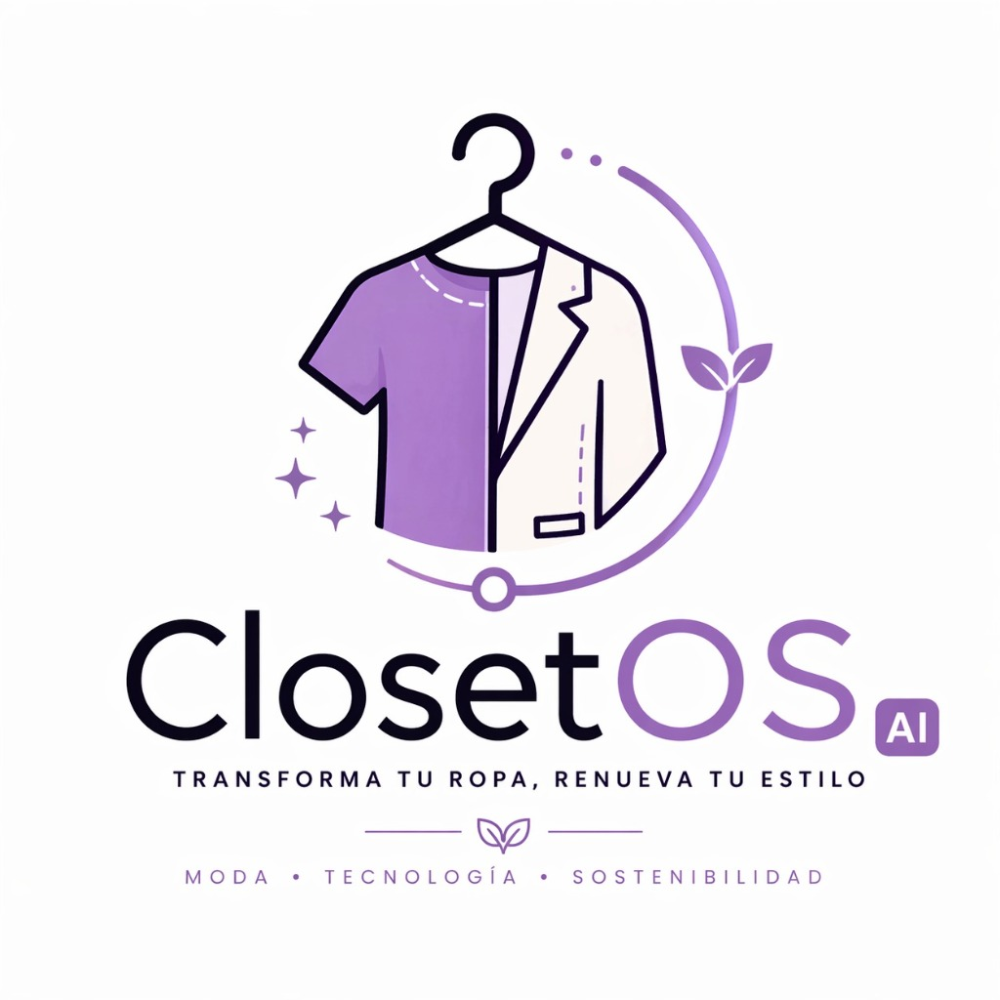

# ClosetOS AI

<p align="center">
	
</p>

<p align="center"><strong>Reinventa tu ropa. Transforma tu estilo. Sin comprar más.</strong></p>

<p align="center">
	<a href="closetos-landing.html">Ver landing</a> ·
	<a href="#ai-style-preview">Probar AI Style Preview</a> ·
	<a href="#ejecutar-localmente">Ejecutar localmente</a>
</p>

<p align="center">
	
	
	
	
</p>

> Una landing interactiva de moda circular que conecta prendas sin uso con transformaciones de diseño asistidas por inteligencia artificial.

## En 30 segundos

ClosetOS AI es un prototipo estático construido con HTML, CSS y JavaScript vanilla. La experiencia permite explorar una prenda, visualizar propuestas de rediseño, cargar una imagen propia y coordinar un recojo en Lima mediante WhatsApp.

| Experiencia | Qué puedes hacer |
| --- | --- |
| **AI Style Preview** | Comparar una prenda antes y después y elegir entre tres propuestas. |
| **Carga de imagen** | Subir una foto y obtener propuestas generadas por Gemini. |
| **Recojo** | Completar datos y preparar una solicitud para WhatsApp. |
| **Asistente** | Consultar precios, planes, garantías y proceso con respuestas guiadas. |

## Contenido de la landing

- **Hero:** propuesta de valor, formulario de nombre y correo y acceso al preview.
- **Métricas:** prendas transformadas, costo promedio, tiempo de entrega y satisfacción.
- **Cómo funciona:** proceso de cuatro pasos, desde la foto hasta la entrega.
- **Historia:** storytelling de ClosetOS AI con video embebido de YouTube.
- **Antes y después:** ejemplos visuales de transformaciones.
- **Beneficios y testimonios:** argumentos de producto y prueba social.
- **Planes:** Free, Smart y Pro.
- **Comunidad:** enlaces a Instagram, TikTok, YouTube y el sitio de ClosetOS.
- **Chatbot:** respuestas locales predefinidas sobre el servicio.
- **Recojo:** modal de confirmación que genera un mensaje para WhatsApp.

## AI Style Preview

El flujo principal funciona así:

```text
Elige una prenda → Selecciona un estilo → Mira el resultado → Agenda el recojo
```

### Demos incluidas

| Prenda | Propuestas disponibles |
| --- | --- |
| Blazer | Crop estructurado, slim fit moderno y custom urbano |
| Jeans | Wide leg moderno, shorts deshilachados y custom con parches |
| Camisa | Crop anudado, slim cuello mao y vestido camisero |

También puedes subir una imagen propia. El navegador crea una previsualización local y aplica transformaciones visuales simples sobre un `canvas`; Gemini identifica la prenda y devuelve tres propuestas en español.

## Estructura

```text
.
├── closetos-landing.html   # Landing completa: HTML, estilos y JavaScript
├── assets/                  # Logo e imágenes de prendas
├── vercel.json              # Redirección de `/` hacia la landing
└── README.md
```

<details>
<summary><strong>Assets disponibles</strong></summary>

- `logo.jpg`
- Blazer: `blazer_before.png`, `blazer_after.png`, `blazer_slim.png`, `blazer_custom.png`
- Jeans: `jeans_before.png`, `jeans_after.png`, `jeans_shorts.png`, `jeans_custom.png`
- Camisa: `camisa_before.png`, `camisa_after.png`, `camisa_mao.png`, `camisa_vestido.png`

</details>

## Ejecutar localmente

No se necesitan dependencias ni un proceso de build.

### Opción rápida

Abre [`closetos-landing.html`](closetos-landing.html) directamente en el navegador.

### Con un servidor local

Desde la raíz del proyecto:

```bash
python -m http.server 8000
```

Luego visita <http://localhost:8000/closetos-landing.html>.

## Integraciones

| Servicio | Uso |
| --- | --- |
| Google Analytics | Medición de visitas mediante `gtag.js`. |
| Google Fonts | Tipografías Playfair Display y DM Sans. |
| YouTube | Video de storytelling y enlace al canal. |
| Gemini API | Análisis de imágenes y generación de propuestas. |
| WhatsApp | Envío de la solicitud de recojo. |

## Despliegue

`vercel.json` configura la ruta raíz para servir `closetos-landing.html`, por lo que el proyecto puede desplegarse como un sitio estático en Vercel sin instalación de dependencias.

## Estado del prototipo

| Área | Estado |
| --- | --- |
| UI responsive | Disponible |
| Demos de prendas | Disponible |
| Chatbot | Demo local con respuestas predefinidas |
| Formularios | Validación en frontend |
| Recojo | Mensaje preparado para WhatsApp |
| Backend y base de datos | No implementados |
| Persistencia de usuarios | No implementada |

> [!WARNING]
> La llamada a Gemini está implementada directamente en el cliente. Antes de usar la landing en producción, traslada la clave a un backend o función serverless para no exponer credenciales y controlar costos, permisos y límites de uso.

El análisis de imágenes requiere conexión a Internet y disponibilidad del endpoint de Gemini.
